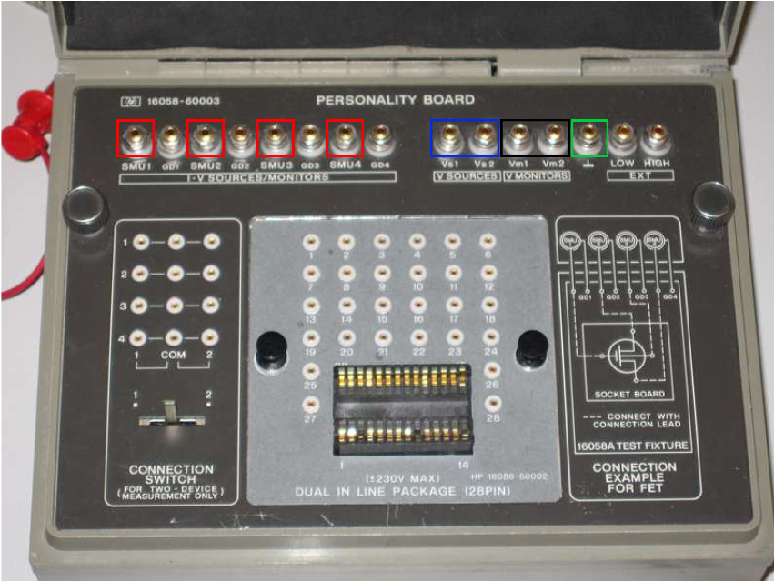

## Procedure

  
**Fig. 1. HP 16058 test fixture**

**Steps to perform the real measurement in HP 4145B Semiconductor Parameter Analyzer**  

Equipment Needed:
-----------------

*   **HP 4145B Semiconductor Parameter Analyzer**: For sourcing voltages, measuring currents, and plotting data.
*   **BJT Transistor**: Device under test (DUT).
*   **Probe Station or Test Fixture**: To securely hold and connect the BJT.

Procedure:
----------

### 1\. Instrument Setup:

*   Power on the HP 4145B and allow it to warm up.
*   Connect appropriate cables and probes according to BJT test setup specifications.
*   Ensure all connections are secure and properly grounded.

### 2\. Software Configuration:

*   Launch the software interface for the HP 4145B (typically PC-based).
*   Configure measurement settings:
    *   Select measurement type: typically current-voltage (I-V) characteristics for both base-emitter voltage ($$V_{BE}$$) and collector current ($$I_C$$).
    *   Set measurement ranges and compliance limits.

### 3\. BJT Mounting and Connections:

*   Mount the BJT securely in the probe station or test fixture.
*   Connect base, emitter, and collector terminals of the BJT to HP 4145B terminals.
*   Ensure proper connections without shorts or loose connections.

### 4\. Measurement Sequence:

*   **Biasing the BJT:**
    *   Apply small base-emitter voltage ($$V_{BE}$$) to start measurement.
    *   Incrementally increase $$V_{BE}$$ while measuring base current ($$I_B$$) and collector current ($$I_C$$).
*   **Data Collection:**
    *   HP 4145B will measure and record $$I_B$$ and $$I_C$$ for each $$V_{BE}$$ point.
    *   Ensure stable measurements within compliance limits.

### 5\. Plotting the Gummel Plot:

*   Use HP 4145B software to plot:
    *   $$I_B$$ vs $$V_{BE}$$
    *   $$I_C$$ vs $$V_{BE}$$
*   Adjust plot settings for clear representation of exponential relationships.

### 6\. Analysis:

*   Analyze plotted data to determine:
    *   Saturation current ($$I_S$$), current gain (β), and other parameters.
    *   Compare with theoretical expectations for validation.

### 7\. Documentation and Reporting:

*   Document measured parameters and characteristics.
*   Prepare report summarizing findings, including any observations or anomalies.

By following these steps, you should be able to successfully obtain and analyze the Gummel Plot of an NPN transistor using the HP 4145B Semiconductor Parameter Analyzer.
