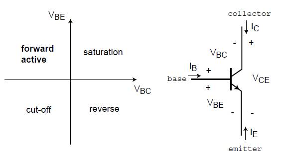

## Theory
**Introduction:**  
The Gummel plot is a fundamental tool in semiconductor device characterization, providing insights into the behavior and parameters of BJTs essential for practical application in electronic circuits. A typical Gummel Plot shown in Figure 1: 

**Fig. 1. Circuit diagram**

Operating Regions of BJT
------------------------

A BJT has three main operating regions:

*   **Cut-off Region:** Both IB and IC are very small.
*   **Active Region:** The transistor operates as an amplifier.
*   **Saturation Region:** The transistor is fully turned on.

Key Equations
-------------

### Collector Current (IC):

$$I_C = I_S (e^{V_{BE}/V_T} - 1)$$

Where:

*   IS is the saturation current.
*   VBE is the base-emitter voltage.
*   VT is the thermal voltage.

### Base Current ($$I_B$$):

$$I_B = I_C / β$$

Where β is the current gain of the transistor.

Gummel Plot Analysis
--------------------

The Gummel plot involves plotting:

1.  **IB vs VBE:** Shows exponential relationship.
2.  **IC vs VBE:** Also shows exponential relationship.

Importance of Gummel Plot
-------------------------

*   **Parameter Extraction:** Enables extraction of key parameters such as `IS`, `β`, and the ideality factor of the transistor.
*   **Device Characterization:** Provides understanding of the transistor's behavior.
*   **Circuit Design:** Essential for designing circuits using BJTs.
*   
     
 
